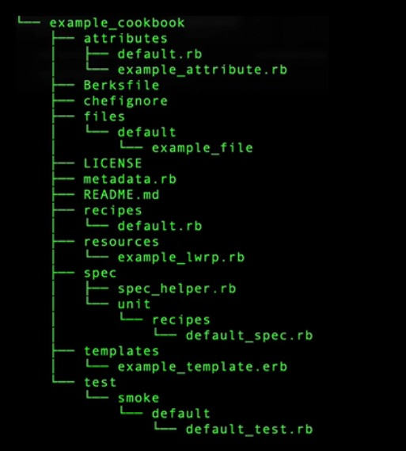

`Attributes`

```bash
chef generate attribute
```

- The attributes directory
  can hold a collection of files,
  which contain attributes, or settings,
  that can be used to configure the infrastructure.
  And for each cookbook loaded, the `default.rb`
  attributes file gets loaded first.

`Recipes`

```bash
chef generate recipe
```

- Recipes is the most fundamental configuration element.
  It contains your configuration instructions.
  Recipes are Ruby code and are a collection of resource names,
  attribute-value pairs, and actions to which helper code
  can be added when necessary.

`Files`

```bash
chef generate file
```

- The directory `file` structure matching these values
  would place the files on the desired platform

`Libraries`

```bash
# can be created manually
```

- Ruby code library to be included in a cookbook.
  Libraries are commonly used to reduce repetition
  by creating helpers.
  Use cases might include connecting to a database,
  interacting with an LDAP provider,
  or creating a custom class or module.

`Resources`

```bash
chef generate lwrp
```

- Custom resources are a collection
  of files located in the resource directory,
  and these act as an extension of Chef
  that allows you to create your own resources.
  A custom resource may be used in a recipe,
  just like any of the resources that are built into Chef.

`Providers`

```bash
chef generate lwrp
```

- Provider defines the steps
  to create the desired state
  and the code necessary to converge the node.

`Metadata`, chef generate cookbook,

```bash
chef generate cookbook
chef generate repo
chef generate app
```

- The contents of the metadata.rb file provide hints
  to a Chef server to help ensure that cookbooks are deployed correctly.

`Templates`

```bash
chef generate template
```

- Templates are located in the templates directory,
  are in embedded Ruby ERB format.

`test`

```bash
# it can be generated with recipes
# when using a generator.
```

- `test/integration/<suite>`
  where `suite` is the name defined in `.kitchen.yml`

---

`Data Bags`

- Data bags store data for global variables inn JSON format
- Data bags are indexed, making them easier to use for searching
- They can be loaded by a cookbook or they can ba accessed during a search.
